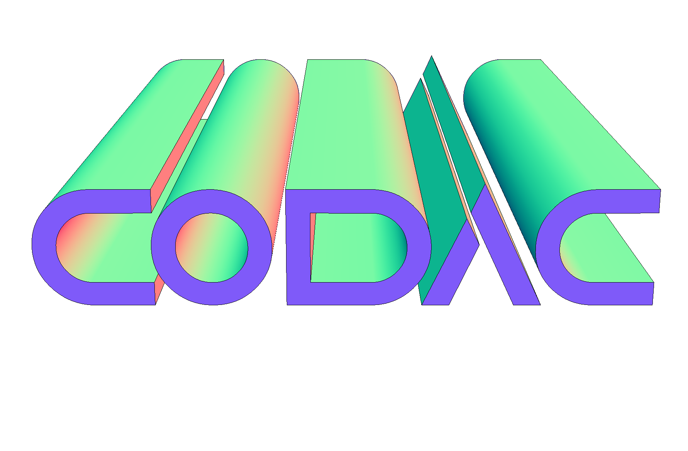
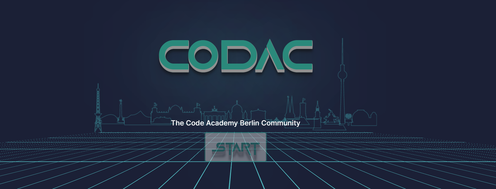
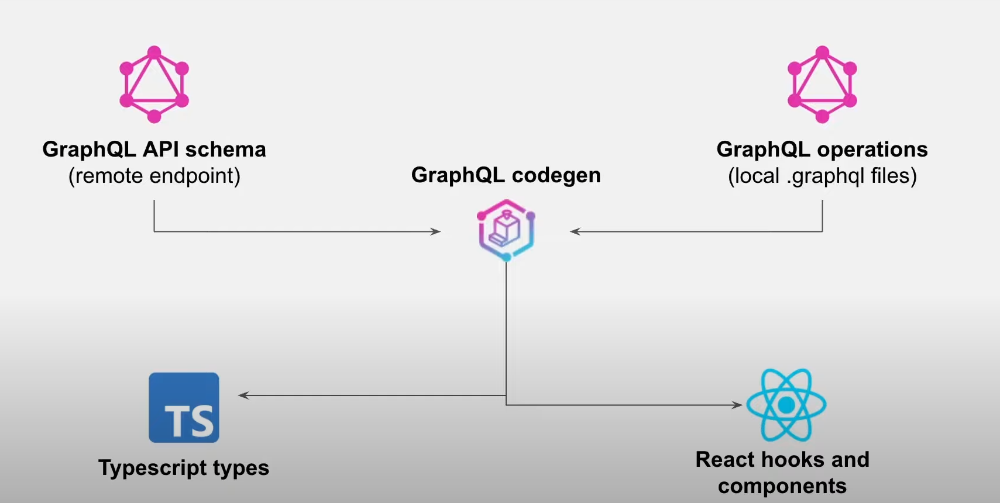

<a name="readme-top"></a>

[![Contributors][contributors-shield]][contributors-url]
[![Forks][forks-shield]][forks-url]
[![Stargazers][stars-shield]][stars-url]
[![Issues][issues-shield]][issues-url]
[![MIT License][license-shield]][license-url]

<!-- PROJECT LOGO -->
<br />
<div align="center">
  <a href="https://github.com/codeacademyberlin/codac-ts-frontend-students">
    
  </a>


  <p align="center">
    <br />
    <a href="https://github.com/codeacademyberlin/codac-ts-frontend-students"><strong>Explore the docs »</strong></a>
    <br />
    <br />
    <a href="https://www.codac.academy/">View Demo</a>
    ·
    <a href="https://github.com/codeacademyberlin/codac-ts-frontend-students/issues">Report Bug</a>
    ·
    <a href="https://github.com/codeacademyberlin/codac-ts-frontend-students/issues">Request Feature</a>
  </p>
</div>


<!-- TABLE OF CONTENTS -->
<details>
  <summary>Table of Contents</summary>
  <ol>
    <li>
      <a href="#about-the-project">About The Project</a>
      <ul>
        <li><a href="#built-with">Built With</a></li>
      </ul>
    </li>
    <li>
      <a href="#getting-started">Getting Started</a>
      <ul>
        <li><a href="#prerequisites">Prerequisites</a></li>
        <li><a href="#installation">Installation</a></li>
      </ul>
    </li>
    <li><a href="#folder-structure">Folder Structure</a></li>
    <li><a href="#cab-server">CAB Server</a></li>
    <li><a href="#roadmap">Roadmap</a></li>
    <li><a href="#contributing">Contributing</a></li>
    <li><a href="#license">License</a></li>
    <li><a href="#contact">Contact</a></li>
    <li><a href="#acknowledgments">Acknowledgments</a></li>
  </ol>
</details>


<!-- ABOUT THE PROJECT -->
## About The Project



**CODAC** stands for **Code Academy Berlin Community**.


This platform is the heart of resources necessary to carry out the courses in **Data Science** or **Web Development** offered by the start up training center [![CAB][cab-shield]][cab-url]

It is intended to be improved and maintained by students of the Academy. Particularly during the last project of the web development course and introduces students to a set of advanced new concepts and technologies such as **Server Side Rendering**.

<p align="right">(<a href="#readme-top">back to top</a>)</p>


### Built With

[![React][React.js]][React-url]

**React.js** is a free and open-source front-end JavaScript library for building user interfaces based on UI components. 

[![Next][Next.js]][Next-url]

**Next.js** is an open-source web development framework enabling React-based web applications with server-side rendering and generating static websites.

[![Typescript][Typescript.js]][Typescript-url]

**TypeScript** is a strongly typed programming language that builds on JavaScript, giving you better tooling at any scale.

[![GraphQL][GraphQL]][GraphQL-url]

**GraphQL** is a query language for APIs and a runtime for fulfilling those queries with your existing data.


<!-- GETTING STARTED -->
## Getting Started

This is an example of how you may give instructions on setting up your project locally.
To get a local copy up and running follow these simple example steps.

### Prerequisites
- Node
- Yarn package manager
* npm
  ```sh
  npm i yarn -g
  ```

### Installation

1. Clone the repo
   ```sh
   git clone https://github.com/codeacademyberlin/codac-ts-frontend-students.git
   ```
2. Install NPM packages(yarn preferred)
   ```sh
   yarn
    # or
   npm install
   ```
3. rename `.env.local.example` to `.env.local` and request the missing api keys
4. Run the Next.js app in dev mode
    ```bash
    yarn dev
    # or
    npm run dev
    ```

Open [http://localhost:3000](http://localhost:3000) with your browser to see the result.

<p align="right">(<a href="#readme-top">back to top</a>)</p>


<!-- FOLDER STRUCTURE -->
## Folder Structure
### Main Structure
```sh
├── cabServer # Queries & Mutations for Code Academy Berlin's GraphQl Server and generated types
├── components # Home grown components organized in subfolder for every pages
|   ├── page subfolder...
├── componentsDemo # DEMO components for pages (to be moved to components folder if used)
├── content # Git submodule sourcing data for the LMS
├── context # React context providers
│   ├── authContext # User Authentication
│   ├── settingsContext # User Preferences (look & feel)
├── layouts # Home grown layouts components
├── lib # Utilities 
├── navigation # Routing links
├── pages # See below
├── pagesDemo # THESE PAGES ARE CURRENTLY ONLY FOR DEMO(To be deleted)
├── public #Static assets (Images, Fonts)**
├── styles # global styles
├── theme # MUI theme definition
├── types # global types 
├── env.local # Private variables of the app (DO NOT PUSH TO GITHUB!)
├── env.local.example # Describe the variables names of .env.local file) (VARIABLES VALUE SHOULD BE DUMMY!)
├── package.json
└── .gitignore # list of files to be not tracked by source control
└── .gitmodules # refers to the git submodule for the LMS data
└── codegen.yml # setting for code generation of the types of CAB Servers
└── ... # more configurations files
```
### Pages Structure
#### Rendering method:
- λ  (Server)  server-side renders at runtime (uses getInitialProps or getServerSideProps)
- ○  (Static)  automatically rendered as static HTML (uses no initial props)
- ●  (SSG)     automatically generated as static HTML + JSON (uses getStaticProps)
```sh
┌ ○ /                                                                      
├   /_app # Entry point of Next.js wrapped by providers                                                                 
├ ○ /401                                                                   
├ ○ /404                                                                   
├ ○ /500                                                                   
├ λ /api/lms-links                                                         
├ λ /api/open-ai                                                           
├ λ /api/user                                                              
├ ○ /battles                                                               
├ λ /community                                                             
├ ○ /congrats                                                              
├ λ /dashboard                                                             
├ λ /jobs                                                                  
├ ● /lms/[[...page]] (5552 ms)                                             
├   ├ /lms/data/Module-1/Project-2/Machine-Learning-Fundamentals 
├   ├ /lms/career/Step-1/Chapter-1
├   ├ /lms/career/Step-1/Chapter-2
├   ├ /lms/career/Step-1/Chapter-3
├   ├ /lms/career/Step-1/Chapter-4
├   ├ /lms/career/Step-1
├   ├ /lms/career/Step-2/Task-1
├   └ [+70 more paths]
├ ○ /login                                                                 
├ ○ /pagesDemo/cards                                                       
├ ○ /pagesDemo/form-layouts                                                
├ ○ /pagesDemo/icons                                                       
├ ○ /pagesDemo/register                                                    
├ ○ /pagesDemo/tables                                                      
├ ○ /pagesDemo/typography                                                  
├ λ /profile                                                               
├ λ /projects                                                             
└ ● /projects/[project]                                                   
    └ /projects/CODAC
```


<p align="right">(<a href="#readme-top">back to top</a>)</p>

<!-- CAB Server -->
## CAB Server

The **CAB Server** refers to the Code Academy Berlin Administration Backend and hold various data about the Academy

It is built with the Framework **Strapi** and offers a **GraphQL** API.

[![Strapi][Strapi]][Strapi-url]

Queries & Mutation to are to be described in the cabServer folder before being generated through code generation for use in the app:



to regenerate the api types run script
   ```sh
   yarn codegen
    # or
   npm run codegen
   ```

<!-- ROADMAP -->
## Roadmap


See the [open issues](https://github.com/codeacademyberlin/codac-ts-frontend-students/issues) for a full list of proposed features (and known issues).

<p align="right">(<a href="#readme-top">back to top</a>)</p>


<!-- CONTRIBUTING -->
## Contributing

Contributions are made by the students of **Code Academy Berlin**.

1. Fork the Project & Request to be a collaborator
2. Create your Feature Branch
3. Commit your Changes
4. Push to the Branch
5. Open a Pull Request

<p align="right">(<a href="#readme-top">back to top</a>)</p>


<!-- LICENSE -->
## License

Distributed under the MIT License. See `LICENSE.txt` for more information.

<p align="right">(<a href="#readme-top">back to top</a>)</p>


<!-- CONTACT -->
## Contact

Lucas Dupias - lucas@codeacademyberlin.com

[https://github.com/Loukass23](https://github.com/Loukass23)

<p align="right">(<a href="#readme-top">back to top</a>)</p>


<!-- ACKNOWLEDGMENTS -->
## Acknowledgments

* December 2022 - **Neon Narwhals** Cohort
  - [Alberto](https://github.com/BetoCarrillo)
    - Job offer page
  - [Jan](https://github.com/petrikoj)
    - Progress bar dashboard component
    - My Cohort dashboard component
  - [Emily](https://github.comMadame-Aehm)
    - Lms page
    - Community page
    - themes design
  - [Philipp](https://github.com/philippspiegler)
    - VS Battle page

* []()
* []()

<p align="right">(<a href="#readme-top">back to top</a>)</p>


<!-- MARKDOWN LINKS & IMAGES -->
<!-- https://www.markdownguide.org/basic-syntax/#reference-style-links -->
[contributors-shield]: https://img.shields.io/github/contributors/codeacademyberlin/codac-ts-frontend-students.svg?style=for-the-badge
[contributors-url]: https://github.com/codeacademyberlin/codac-ts-frontend-students/graphs/contributors
[cab-shield]: https://img.shields.io/badge/Code%20Academy%20Berlin-%2300897D
[cab-url]: https://www.codeacademyberlin.com
[forks-shield]: https://img.shields.io/github/forks/codeacademyberlin/codac-ts-frontend-students.svg?style=for-the-badge
[forks-url]: https://github.com/codeacademyberlin/codac-ts-frontend-students/network/members
[stars-shield]: https://img.shields.io/github/stars/codeacademyberlin/codac-ts-frontend-students.svg?style=for-the-badge
[stars-url]: https://github.com/codeacademyberlin/codac-ts-frontend-students/stargazers
[issues-shield]: https://img.shields.io/github/issues/codeacademyberlin/codac-ts-frontend-students.svg?style=for-the-badge
[issues-url]: https://github.com/codeacademyberlin/codac-ts-frontend-students/issues
[license-shield]: https://img.shields.io/github/license/codeacademyberlin/codac-ts-frontend-students.svg?style=for-the-badge
[license-url]: https://github.com/codeacademyberlin/codac-ts-frontend-students/blob/master/LICENSE.txt
[linkedin-shield]: https://img.shields.io/badge/-LinkedIn-black.svg?style=for-the-badge&logo=linkedin&colorB=555
[linkedin-url]: https://www.linkedin.com/school/codeacademyberlin
[product-screenshot]: images/screenshot.png
[Next.js]: https://img.shields.io/badge/next.js-000000?style=for-the-badge&logo=nextdotjs&logoColor=white
[Next-url]: https://nextjs.org/
[React.js]: https://img.shields.io/badge/React-20232A?style=for-the-badge&logo=react&logoColor=61DAFB
[React-url]: https://reactjs.org/
[Typescript-url]: https://www.typescriptlang.org/
[Typescript.js]: https://img.shields.io/badge/Typescript.js-35495E?style=for-the-badge&logo=typescript&logoColor=3178c6
[GraphQL-url]: https://graphql.org/
[GraphQL]: https://img.shields.io/badge/-GraphQL-E10098?style=for-the-badge&logo=graphql&logoColor=white
[Strapi-url]: https://strapi.io/
[Strapi]: https://img.shields.io/badge/strapi-%232E7EEA.svg?style=for-the-badge&logo=strapi&logoColor=white
